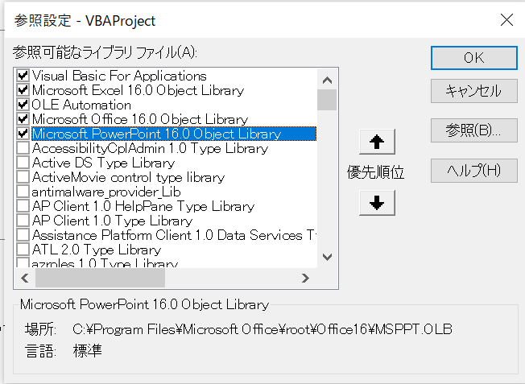
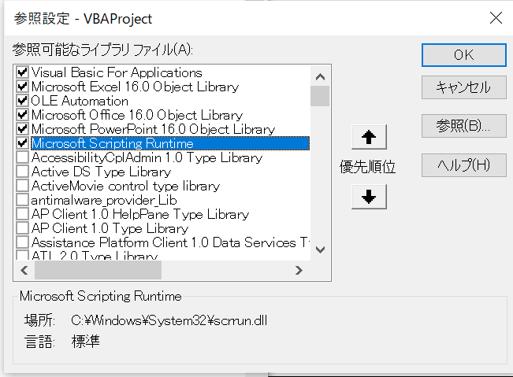

### PowerPointを操作するライブラリを参照に入れる
* VBEでツール-参照設定で参照設定を開いて、PowerPointのObjectLibraryを参照オンする
  * 


### FileSystemObjectを操作するライブラリを参照に入れる
* VBEでツール-参照設定で参照設定を開いて、PowerPointのObjectLibraryを参照オンする
  * 
## 参考情報：リファレンス
PowerPoint VBAリファレンス
https://docs.microsoft.com/ja-jp/office/vba/api/overview/powerpoint

* 今回は、オブジェクトとして、PowerPoint.ApplicationとPowerPoint.Presentationを使う
  * Applicationがパワーポイントの起動プロセス、プレゼンテーションが１ファイルというイメージ
  * Application
    * https://docs.microsoft.com/ja-jp/office/vba/api/powerpoint.application
  * Presentation
    * https://docs.microsoft.com/ja-jp/office/vba/api/powerpoint.presentation

VBAリファレンス
FileSystemObject
https://docs.microsoft.com/ja-jp/office/vba/language/reference/user-interface-help/filesystemobject-object
## 


```

```
